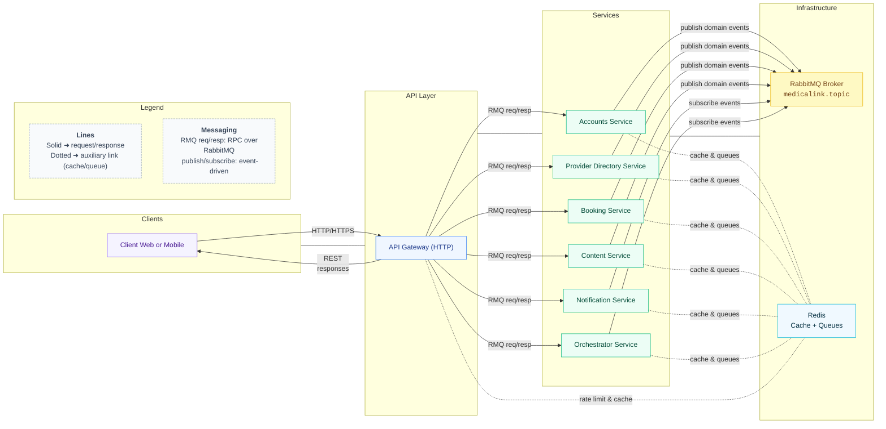

# MedicaLink Microservices

A comprehensive microservices-based medical appointment booking system built with NestJS, Prisma, PostgreSQL, RabbitMQ, and Redis.

## 🏗️ Architecture

This system follows a microservices architecture with 6 core services plus an API Gateway:

1. Accounts & Identity Service — authentication, staff accounts
2. Provider Directory Service — doctor profiles, specialties, work locations, schedules
3. Booking & Appointments Service — appointments booking, scheduling, management, patient profiles
4. Content & Community Service — blogs, Q&A, reviews
5. Notification & Communications Service — email, SMS, push notifications
6. Orchestrator Service — command orchestration and read composition (sagas, aggregation, cache)
7. API Gateway — Backend for Frontend (HTTP)

### Entrypoints

- API Gateway HTTP server: initializes ValidationPipe, Interceptors, Filters, CORS, prefix 'api', and listens on API_GATEWAY_PORT or 3000; see [apps/api-gateway/src/main.ts](apps/api-gateway/src/main.ts).
- Microservices (Accounts, Provider, Booking, Content, Notification) run as RabbitMQ consumers only, no HTTP server: [apps/accounts-service/src/main.ts](apps/accounts-service/src/main.ts), [apps/provider-directory-service/src/main.ts](apps/provider-directory-service/src/main.ts), [apps/booking-service/src/main.ts](apps/booking-service/src/main.ts), [apps/content-service/src/main.ts](apps/content-service/src/main.ts), [apps/notification-service/src/main.ts](apps/notification-service/src/main.ts), [apps/orchestrator-service/src/main.ts](apps/orchestrator-service/src/main.ts).

## 🛠️ Technology Stack

- Framework: NestJS
- Language: TypeScript
- Database: PostgreSQL (Supabase) with schema separation
- ORM: Prisma
- Message Broker: RabbitMQ
- Cache: Redis
- Authentication: JWT
- Package Manager: pnpm
- Container: Docker & Docker Compose

## 📁 Project Structure

```
medicalink-microservice/
├── apps/
│   ├── api-gateway/                 # API Gateway (BFF)
│   ├── accounts-service/            # Authentication & User Management
│   ├── provider-directory-service/  # Doctors & Schedules
│   ├── booking-service/             # Appointments & Booking
│   ├── content-service/             # Blogs, Q&A, Reviews
│   ├── notification-service/        # Notifications
│   ├── orchestrator-service/        # Orchestrator Service (sagas & read composition)
├── libs/
│   ├── contracts/               # Shared types and events
│   ├── domain-errors/           # Shared error definitions
│   ├── error-adapters/          # Shared error handling
│   ├── rabbitmq/                # RMQ config, patterns, module
│   ├── redis/                   # Redis client and utilities
│   └── repositories/            # Shared base repositories
├── docs/                        # Documentation
├── development/docker-compose.yml
└── README.md
```

## 🚀 Quick Start

### Prerequisites

- Node.js 18+
- pnpm
- Docker & Docker Compose
- PostgreSQL (or via Docker)
- Redis (or via Docker)
- RabbitMQ (or via Docker)

### Setup

1. Clone the repository
   ```bash
   git clone <repository-url>
   cd medicalink-microservice
   ```

2. Install dependencies
   ```bash
   pnpm install
   ```

3. Copy environment variables
   ```bash
   cp .env.example .env
   ```
   Edit `.env` with your database and infrastructure URLs.

4. Start infrastructure
   ```bash
   docker-compose -f development/docker-compose.yml up -d postgres redis rabbitmq
   ```

5. Generate and push Prisma schemas
   ```bash
   pnpm run prisma:generate
   pnpm run prisma:push
   ```

6. Bootstrap permissions data
   ```bash
   pnpm script -- --service=accounts-service --filename=create-super-admin
   pnpm script -- --service=accounts-service --filename=clear-permissions
   pnpm script -- --service=accounts-service --filename=permission-seeds
   ```

### Development

**Start all services**

```bash
pnpm run dev
```

**Start individual services**

```bash
pnpm run start:accounts      # Accounts Service
pnpm run start:provider      # Provider Directory Service
pnpm run start:booking       # Booking Service
pnpm run start:content       # Content Service
pnpm run start:notification  # Notification Service
pnpm run start:orchestrator  # Orchestrator Service
pnpm run start:gateway       # API Gateway
```

## 🗄️ Database Structure

All services share a single PostgreSQL database with schema separation:

- accounts schema — staff accounts and patient profiles
- provider schema — doctors, specialties, locations, schedules
- booking schema — appointments and booking management
- content schema — blogs, questions, answers, reviews
- notification schema — notification templates and deliveries

This approach reduces costs while maintaining logical separation between services.

## 🔌 Service Communication

- Inter-service: RabbitMQ request/response via [RabbitMQConfig](libs/rabbitmq/src/rabbitmq-config.ts) and queues defined in [QUEUE_NAMES](libs/rabbitmq/src/rabbitmq-patterns.ts).
- Events: topic exchange [EXCHANGE_NAMES](libs/rabbitmq/src/rabbitmq-patterns.ts) and [ROUTING_KEYS](libs/rabbitmq/src/rabbitmq-patterns.ts) for async pub/sub.
- Gateway mapping: REST → RMQ via MicroserviceService; see [apps/api-gateway/src/utils/microservice.service.ts](apps/api-gateway/src/utils/microservice.service.ts).
- Health: services expose broker health via MessagePattern; see [apps/booking-service/src/health/health.controller.ts](apps/booking-service/src/health/health.controller.ts).
- Caching: Redis used for frequently accessed data and permission snapshots via [RedisService](libs/redis/src/redis.service.ts).

## 📡 API Endpoints (Gateway)

- Auth: login, refresh, profile, change-password, verify-password — see [auth.controller.ts](apps/api-gateway/src/auth/auth.controller.ts)
- Doctors: list, stats, get by id — see [doctors.controller.ts](apps/api-gateway/src/doctors/doctors.controller.ts)
- Doctor Profile: public list, get, create, update, toggle-active, remove — see [doctor-profile.controller.ts](apps/api-gateway/src/doctors/doctor-profile.controller.ts)
- Specialties: public list, stats, by slug, by id; info-sections CRUD — see [specialties.controller.ts](apps/api-gateway/src/specialties/specialties.controller.ts)
- Work Locations: public list, stats, get, create, update, remove — see [work-locations.controller.ts](apps/api-gateway/src/work-locations/work-locations.controller.ts)
- Patients: create, get, update, remove — see [patients.controller.ts](apps/api-gateway/src/patients/patients.controller.ts)
- Staffs: list, stats, get, update, remove — see [staffs.controller.ts](apps/api-gateway/src/staffs/staffs.controller.ts)
- Permissions: users/groups management, checks, stats — see [permissions.controller.ts](apps/api-gateway/src/permissions/permissions.controller.ts)
- Health: [health.controller.ts](apps/api-gateway/src/health/health.controller.ts)

### Content: Blogs, Questions/Answers, Reviews

- Blogs — see [blogs.controller.ts](apps/api-gateway/src/controllers/blogs.controller.ts)
  - Public: `GET /blogs`, `GET /blogs/:id`, `GET /blogs/categories`, `GET /blogs/categories/:id`
  - Doctor: `POST /blogs` (create)
  - Admin: `PATCH /blogs/:id`, `DELETE /blogs/:id`, `POST /blogs/categories`, `PATCH /blogs/categories/:id`, `DELETE /blogs/categories/:id`, `PATCH /blogs/:id/status` (change status)
- Questions & Answers — see [questions.controller.ts](apps/api-gateway/src/controllers/questions.controller.ts)
  - Public: `POST /questions` (throttled), `GET /questions`, `GET /questions/:id`, `GET /questions/:id/answers` (accepted only), `GET /answers/:answerId`
  - Doctor: `POST /questions/:id/answers` (create answer)
  - Admin: `PATCH /questions/:id`, `DELETE /questions/:id`, `PATCH /answers/:answerId`, `DELETE /answers/:answerId`, `POST /answers/:answerId/accept` (accept answer)
- Reviews — see [reviews.controller.ts](apps/api-gateway/src/controllers/reviews.controller.ts)
  - Public: `POST /reviews` (throttled), `GET /reviews`, `GET /reviews/doctors/:doctorId`, `GET /reviews/:id`
  - Admin: `DELETE /reviews/:id`

Notes:
- Public creation endpoints (`POST /questions`, `POST /reviews`) sử dụng rate limit tuỳ biến thông qua decorator `PublicCreateThrottle` (mặc định 3 requests/60s) bên cạnh throttle global.
- Quyền được kiểm soát bằng decorators `Require*Permission` và `Public` từ `libs/contracts` cùng với guards toàn cục.

Note: Booking Service has internal HTTP controllers ([appointments.controller.ts](apps/booking-service/src/appointments/appointments.controller.ts)) but does not expose an HTTP server externally; it communicates via RabbitMQ.

## 🐳 Docker Support

```bash
docker-compose -f development/docker-compose.yml up -d          # Start infra
docker-compose -f development/docker-compose.yml down            # Stop
docker-compose -f development/docker-compose.yml logs -f         # View logs
```
## 🔧 Configuration

Key environment variables (see `.env.example`):

- RABBITMQ_URL — RabbitMQ connection
- API_GATEWAY_PORT — Gateway port
- REDIS_URL or REDIS_HOST/REDIS_PORT/REDIS_TLS — Redis connection
- SERVICE_NAME — key prefixing for Redis

## 🧪 Testing

```bash
pnpm test              # Unit tests
pnpm test:watch        # Watch mode
pnpm test:cov          # Coverage
pnpm test:e2e          # End-to-end tests
```

## 📚 Documentation

See the `docs/` directory for detailed documentation:

- [Microservice Architecture](docs/microservice.md)
- [Database ERD](docs/ERD.md)
- [Redis Architecture](docs/redis-architecture.md)
- [Requirements](docs/requirement.md)
- [Orchestrator Service](docs/orchestrator.md)

## 🤝 Contributing

1. Fork the repository
2. Create a feature branch
3. Commit your changes
4. Push to the branch
5. Create a Pull Request

## 📄 License

This project is licensed under the MIT License.

## 🆘 Support

For support and questions:

- Create an issue in the repository
- Contact the development team
- Check the documentation in `docs/`

---

**Built with ❤️ for modern healthcare solutions**

## 🗺️ System Diagram

