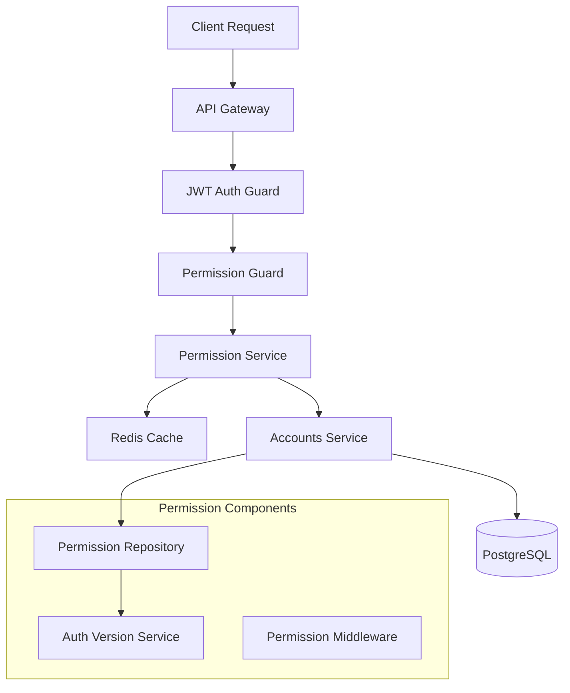

# MedicaLink Permission System Documentation

## Tổng quan

MedicaLink sử dụng một hệ thống permission phân tán, hiệu suất cao với caching Redis để quản lý quyền truy cập trong kiến trúc microservices. Hệ thống hỗ trợ Role-Based Access Control (RBAC) với khả năng áp dụng điều kiện context-based và multi-tenant.

### Kiến trúc tổng thể



---

## Phần 1: Backend Development Guide

### 1.1 Cấu trúc Database

#### 1.1.1 Models chính

```sql
-- Permissions: Định nghĩa các quyền cơ bản
model Permission {
  id          String   @id @default(cuid())
  resource    String   -- Tài nguyên (vd: "appointments", "blogs", "users")
  action      String   -- Hành động (vd: "read", "write", "delete", "manage")
  description String?
  
  userPermissions  UserPermission[]
  groupPermissions GroupPermission[]
}

-- User Permissions: Gán quyền trực tiếp cho user
model UserPermission {
  id           String           @id @default(cuid())
  userId       String
  permissionId String
  effect       PermissionEffect @default(ALLOW) -- ALLOW/DENY
  tenantId     String?          -- Multi-tenant support
  conditions   Json?            -- Context-based conditions
  
  permission Permission @relation(fields: [permissionId], references: [id])
}

-- Groups: Nhóm quyền để quản lý dễ dàng
model Group {
  id          String   @id @default(cuid())
  name        String
  description String?
  tenantId    String?
  
  userGroups       UserGroup[]
  groupPermissions GroupPermission[]
}

-- Auth Versions: Cache invalidation mechanism
model AuthVersion {
  id        String   @id @default(cuid())
  userId    String   @unique
  version   Int      @default(1)
  updatedAt DateTime @updatedAt
}
```

#### 1.1.2 Permission Effects

- **ALLOW**: Cho phép thực hiện hành động
- **DENY**: Từ chối thực hiện hành động (có ưu tiên cao hơn ALLOW)

### 1.2 Core Components

#### 1.2.1 PermissionRepository

```typescript
@Injectable()
export class PermissionRepository {
  constructor(
    private prisma: PrismaService,
    private authVersionService: AuthVersionService,
  ) {}

  // Lấy snapshot permissions của user (cho caching)
  async getUserPermissionSnapshot(
    userId: string,
    tenantId: string = 'global',
  ): Promise<UserPermissionSnapshot | null>

  // Kiểm tra permission với context
  async hasPermission(
    userId: string,
    resource: string,
    action: string,
    tenantId: string = 'global',
    context?: Record<string, any>,
  ): Promise<boolean>

  // Gán quyền cho user
  async assignUserPermission(
    userId: string,
    permissionId: string,
    tenantId: string = 'global',
    effect: 'ALLOW' | 'DENY' = 'ALLOW',
    conditions?: PermissionCondition[],
  ): Promise<boolean>
}
```

#### 1.2.2 AuthVersionService

```typescript
@Injectable()
export class AuthVersionService {
  // Lấy version hiện tại của user (cho cache invalidation)
  async getUserAuthVersion(userId: string): Promise<number>

  // Tăng version để invalidate cache
  async incrementUserAuthVersion(userId: string): Promise<void>
}
```

#### 1.2.3 PermissionService (API Gateway)

```typescript
@Injectable()
export class PermissionService {
  // Kiểm tra permission với caching
  async hasPermission(
    user: JwtPayloadDto,
    resource: string,
    action: string,
    context?: PermissionContext,
  ): Promise<boolean>

  // Lấy permission snapshot (cached)
  async getPermissionSnapshot(
    user: JwtPayloadDto,
  ): Promise<CachedPermissionSnapshot | null>

  // Invalidate cache của user
  async invalidateUserPermissions(
    userId: string,
    tenant: string = 'global',
  ): Promise<void>
}
```

### 1.3 Guards và Decorators

#### 1.3.1 PermissionGuard

```typescript
@Injectable()
export class PermissionGuard implements CanActivate {
  async canActivate(context: ExecutionContext): Promise<boolean> {
    // 1. Check if route is public
    // 2. Get required permissions from metadata
    // 3. Extract user from JWT
    // 4. Build permission context from request
    // 5. Check permissions via PermissionService
    // 6. Allow/deny access
  }
}
```

#### 1.3.2 Permission Decorators

```typescript
// Basic permission decorators
@RequirePermission('appointments', 'read')
@RequirePermissions([
  { resource: 'appointments', action: 'read' },
  { resource: 'appointments', action: 'write' }
])

// Helper decorators
@RequireReadPermission('appointments')
@RequireWritePermission('appointments')
@RequireDeletePermission('appointments')
@RequireManagePermission('appointments')

// Administrative decorators
@RequireSystemAdmin()
@RequirePermissionManagement()
@RequireUserManagement()
```

### 1.4 Cách sử dụng trong Controller

#### 1.4.1 Basic Usage

```typescript
@Controller('appointments')
export class AppointmentsController {
  @Get()
  @RequireReadPermission('appointments')
  async getAppointments() {
    // Chỉ user có quyền "appointments:read" mới access được
  }

  @Post()
  @RequireWritePermission('appointments')
  async createAppointment(@Body() dto: CreateAppointmentDto) {
    // Chỉ user có quyền "appointments:write" mới access được
  }

  @Delete(':id')
  @RequireDeletePermission('appointments')
  async deleteAppointment(@Param('id') id: string) {
    // Chỉ user có quyền "appointments:delete" mới access được
  }
}
```

#### 1.4.2 Context-based Permissions

```typescript
@Controller('appointments')
export class AppointmentsController {
  @Get('doctor/:doctorId')
  @RequirePermission('appointments', 'read', { restrictToDoctor: true })
  async getAppointmentsByDoctor(@Param('doctorId') doctorId: string) {
    // Permission được check với context: { doctorId: 'xxx' }
    // User chỉ có thể xem appointments của doctor được phép
  }

  @Put(':id')
  @RequirePermission('appointments', 'write', { requireOwnership: true })
  async updateAppointment(
    @Param('id') id: string,
    @Body() dto: UpdateAppointmentDto
  ) {
    // Context được build tự động từ request params
    // { appointmentId: 'xxx', userId: 'current-user-id' }
  }
}
```

### 1.5 Permission Conditions

#### 1.5.1 JSON Conditions Format

```typescript
interface PermissionCondition {
  field: string;
  operator: 'eq' | 'ne' | 'in' | 'contains';
  value: any;
}

// Ví dụ: User chỉ có thể xem appointments trong location của mình
const conditions: PermissionCondition[] = [
  {
    field: 'locationId',
    operator: 'in',
    value: ['location1', 'location2'] // Locations user được phép
  }
];
```

#### 1.5.2 Context Building

PermissionGuard tự động build context từ request:

```typescript
// Từ URL params: /appointments/doctor/123
context.doctorId = '123'

// Từ query params: ?locationId=abc
context.locationId = 'abc'

// Từ request body
context.locationId = body.locationId

// Luôn có userId từ JWT
context.userId = user.sub
```

### 1.6 Caching Strategy

#### 1.6.1 Permission Snapshots

```typescript
interface UserPermissionSnapshot {
  userId: string;
  tenant: string;
  version: number;
  permissions: string[]; // Array của "resource:action" strings
}

// Cache key format: "permissions:userId:tenant:version"
// TTL: 5 minutes
```

#### 1.6.2 Cache Invalidation

- **Automatic**: Khi user permissions thay đổi, `AuthVersionService` tăng version
- **Manual**: Gọi `PermissionService.invalidateUserPermissions()`
- **Pattern**: Cache được invalidate bằng pattern matching

### 1.7 Setup và Configuration

#### 1.7.1 Module Dependencies

```typescript
// accounts-service
@Module({
  imports: [AuthVersionModule], // Required for PermissionRepository
  providers: [PermissionRepository],
  exports: [PermissionRepository],
})
export class PermissionModule {}

// api-gateway
@Module({
  imports: [JwtModule, RedisModule],
  providers: [
    PermissionService,
    {
      provide: APP_GUARD,
      useClass: JwtAuthGuard, // Must run before PermissionGuard
    },
    {
      provide: APP_GUARD,
      useClass: PermissionGuard,
    },
  ],
})
export class ApiGatewayModule {}
```

#### 1.7.2 Middleware Setup

```typescript
// Inject PermissionService vào request context
@Injectable()
export class PermissionMiddleware implements NestMiddleware {
  constructor(private readonly permissionService: PermissionService) {}

  use(req: Request, res: Response, next: NextFunction) {
    req['permissionService'] = this.permissionService;
    next();
  }
}
```

### 1.8 Best Practices

#### 1.8.1 Permission Naming Convention

```typescript
// Format: "resource:action"
"appointments:read"
"appointments:write"
"appointments:delete"
"appointments:manage" // Bao gồm tất cả actions

"staff:read"
"staff:write"
"staff:manage"

"system:admin" // Super admin
"permissions:manage" // Quản lý permissions
```

#### 1.8.2 Error Handling

```typescript
try {
  await permissionService.requirePermission(user, 'appointments', 'read');
} catch (error) {
  // Throw ForbiddenException với message rõ ràng
  throw new ForbiddenException(
    'Insufficient permissions. Required: appointments:read'
  );
}
```

#### 1.8.3 Testing Permissions

```typescript
describe('AppointmentsController', () => {
  it('should allow read access with valid permission', async () => {
    // Mock permission service
    jest.spyOn(permissionService, 'hasPermission').mockResolvedValue(true);
    
    const result = await controller.getAppointments();
    expect(result).toBeDefined();
  });

  it('should deny access without permission', async () => {
    jest.spyOn(permissionService, 'hasPermission').mockResolvedValue(false);
    
    await expect(controller.getAppointments()).rejects.toThrow(ForbiddenException);
  });
});
```

---

## Phần 2: End-to-End User Guide

### 2.1 Permission Management Workflow

#### 2.1.1 Tạo Permission mới

```http
POST /api/permissions
Authorization: Bearer <jwt-token>
Content-Type: application/json

{
  "resource": "medical-records",
  "action": "read",
  "description": "Read medical records"
}
```

#### 2.1.2 Gán Permission cho User

```http
POST /api/permissions/users/{userId}/assign
Authorization: Bearer <jwt-token>
Content-Type: application/json

{
  "permissionId": "perm_123",
  "effect": "ALLOW",
  "tenantId": "global",
  "conditions": [
    {
      "field": "locationId",
      "operator": "eq",
      "value": "location_abc"
    }
  ]
}
```

#### 2.1.3 Tạo Group và gán Permissions

```http
POST /api/permissions/groups
Authorization: Bearer <jwt-token>
Content-Type: application/json

{
  "name": "Doctors",
  "description": "Medical doctors group",
  "tenantId": "hospital_1"
}

POST /api/permissions/groups/{groupId}/permissions
Authorization: Bearer <jwt-token>
Content-Type: application/json

{
  "permissionId": "perm_123",
  "effect": "ALLOW"
}
```

#### 2.1.4 Gán User vào Group

```http
POST /api/permissions/users/{userId}/groups
Authorization: Bearer <jwt-token>
Content-Type: application/json

{
  "groupId": "group_456",
  "tenantId": "hospital_1"
}
```

### 2.2 Các Scenarios thực tế

#### 2.2.1 Scenario 1: Doctor chỉ xem appointments của mình

**Setup:**
```http
# 1. Tạo permission
POST /api/permissions
{
  "resource": "appointments",
  "action": "read",
  "description": "Read appointments"
}

# 2. Gán permission với condition
POST /api/permissions/users/doctor_123/assign
{
  "permissionId": "perm_appointments_read",
  "effect": "ALLOW",
  "conditions": [
    {
      "field": "doctorId",
      "operator": "eq",
      "value": "doctor_123"
    }
  ]
}
```

**Usage:**
```http
# ✅ Được phép - doctorId match
GET /api/appointments/doctor/doctor_123

# ❌ Bị từ chối - doctorId không match
GET /api/appointments/doctor/doctor_456
```

#### 2.2.2 Scenario 2: Nurse chỉ xem patients trong location

**Setup:**
```http
# 1. Gán nurse vào group với location restrictions
POST /api/permissions/users/nurse_789/groups
{
  "groupId": "nurses_location_a",
  "tenantId": "hospital_1"
}

# 2. Group có permission với condition
POST /api/permissions/groups/nurses_location_a/permissions
{
  "permissionId": "perm_patients_read",
  "effect": "ALLOW",
  "conditions": [
    {
      "field": "locationId",
      "operator": "eq",
      "value": "location_a"
    }
  ]
}
```

**Usage:**
```http
# ✅ Được phép - trong location A
GET /api/patients?locationId=location_a

# ❌ Bị từ chối - ngoài location A
GET /api/patients?locationId=location_b
```

#### 2.2.3 Scenario 3: Admin có full access

**Setup:**
```http
# 1. Gán system admin permission
POST /api/permissions/users/admin_001/assign
{
  "permissionId": "perm_system_admin",
  "effect": "ALLOW"
}

# 2. System admin có thể access mọi resource
```

**Usage:**
```http
# ✅ Tất cả đều được phép
GET /api/appointments
GET /api/patients
GET /api/staff
POST /api/permissions/users/xxx/assign
DELETE /api/staff/xxx
```

### 2.3 Permission Testing Flow

#### 2.3.1 Test Permission Check

```http
POST /api/permissions/check
Authorization: Bearer <jwt-token>
Content-Type: application/json

{
  "resource": "appointments",
  "action": "read",
  "context": {
    "doctorId": "doctor_123",
    "locationId": "location_a"
  }
}

Response:
{
  "hasPermission": true,
  "message": "Permission granted",
  "checkedAt": "2025-09-18T01:35:00Z"
}
```

#### 2.3.2 Get User Permissions

```http
GET /api/permissions/users/{userId}
Authorization: Bearer <jwt-token>

Response:
{
  "userId": "user_123",
  "tenant": "hospital_1",
  "version": 5,
  "permissions": [
    "appointments:read",
    "appointments:write",
    "patients:read"
  ],
  "groups": [
    {
      "id": "group_doctors",
      "name": "Doctors",
      "permissions": ["medical-records:read"]
    }
  ]
}
```

### 2.4 Troubleshooting Common Issues

#### 2.4.1 Permission Denied Issues

**Vấn đề:** User không thể access resource mặc dù đã gán permission

**Debug steps:**
```http
# 1. Check user permissions
GET /api/permissions/users/{userId}

# 2. Test specific permission
POST /api/permissions/check
{
  "resource": "target_resource",
  "action": "target_action",
  "context": { /* request context */ }
}

# 3. Check auth version (cache issue)
GET /api/auth/version/{userId}

# 4. Force refresh cache
POST /api/permissions/users/{userId}/refresh
```

#### 2.4.2 Cache Issues

**Vấn đề:** Permissions không update real-time

**Giải pháp:**
```http
# 1. Invalidate specific user cache
DELETE /api/permissions/cache/{userId}

# 2. Force refresh permission snapshot
POST /api/permissions/users/{userId}/refresh

# 3. Check auth version increment
GET /api/auth/version/{userId}
```

#### 2.4.3 Context-based Permission Issues

**Vấn đề:** Permission với conditions không work

**Debug:**
```http
# 1. Check permission conditions
GET /api/permissions/{permissionId}

# 2. Test với debug context
POST /api/permissions/check
{
  "resource": "appointments",
  "action": "read",
  "context": {
    "doctorId": "doctor_123",
    "debug": true
  }
}

# Response sẽ include debug info
{
  "hasPermission": false,
  "debug": {
    "conditions": [{"field": "doctorId", "operator": "eq", "value": "doctor_456"}],
    "context": {"doctorId": "doctor_123"},
    "conditionResults": [false]
  }
}
```

### 2.5 Monitoring và Logging

#### 2.5.1 Permission Check Logs

```bash
# Logs trong API Gateway
[PermissionGuard] User doctor@example.com granted access - permission: appointments:read
[PermissionGuard] User nurse@example.com denied access - missing permission: staff:manage

# Logs trong Accounts Service
[PermissionRepository] Permission check: user=user_123, resource=appointments, action=read, result=true
[AuthVersionService] Auth version incremented for user=user_123, new_version=6
```

#### 2.5.2 Performance Monitoring

```http
# Cache hit rate
GET /api/metrics/permissions/cache

Response:
{
  "totalRequests": 1000,
  "cacheHits": 850,
  "cacheMisses": 150,
  "hitRate": 0.85,
  "avgResponseTime": "2.5ms"
}
```

### 2.6 Security Best Practices

#### 2.6.1 Principle of Least Privilege

- Chỉ gán permissions cần thiết
- Sử dụng conditions để hạn chế scope
- Regular audit permissions

#### 2.6.2 DENY Effect Usage

```http
# Ví dụ: Tạm thời revoke access mà không xóa permission
POST /api/permissions/users/{userId}/assign
{
  "permissionId": "perm_appointments_write",
  "effect": "DENY"  // Override existing ALLOW
}
```

#### 2.6.3 Multi-tenant Isolation

```http
# Permissions được isolated theo tenant
POST /api/permissions/users/{userId}/assign
{
  "permissionId": "perm_patients_read",
  "tenantId": "hospital_1",  // Chỉ áp dụng trong hospital_1
  "effect": "ALLOW"
}
```

---

## Kết luận

Hệ thống permission của MedicaLink cung cấp:

- **Hiệu suất cao** với Redis caching
- **Linh hoạt** với context-based permissions
- **Bảo mật** với principle of least privilege
- **Scalable** với multi-tenant support
- **Developer-friendly** với decorators và guards

Để triển khai thành công, cần:
1. Thiết kế permission scheme phù hợp với business logic
2. Setup proper caching và monitoring
3. Test thoroughly với các scenarios thực tế
4. Monitor performance và security issues
