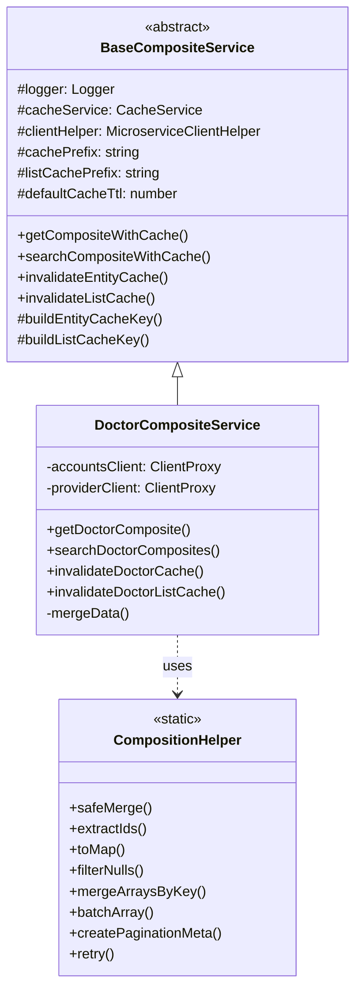
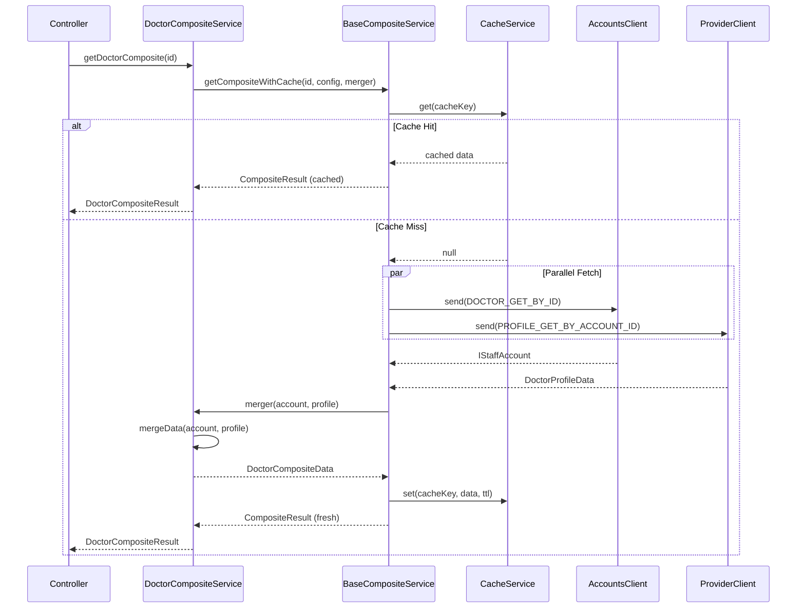
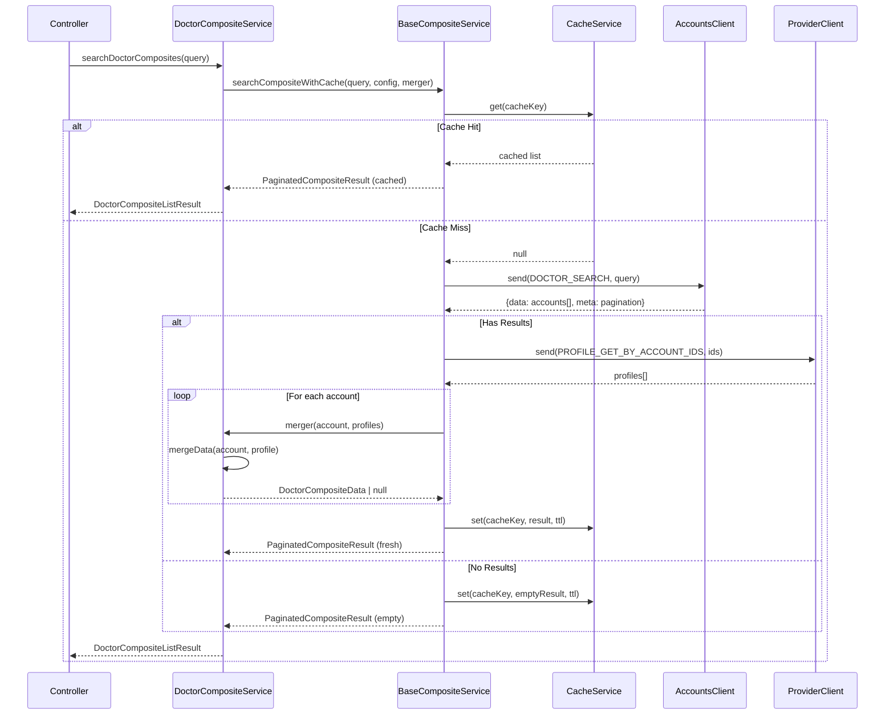
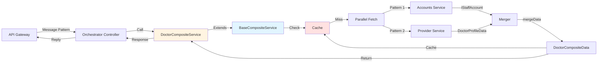
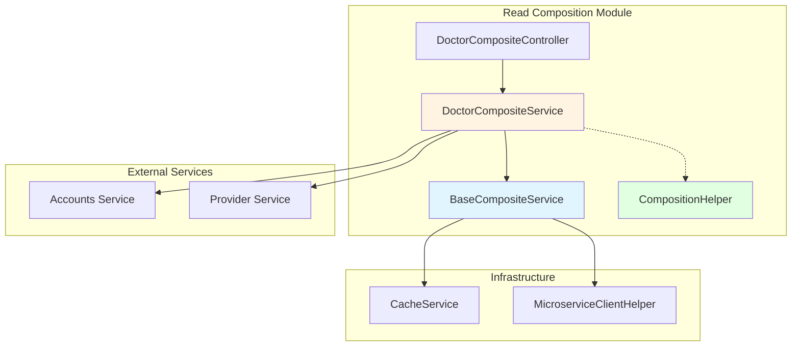
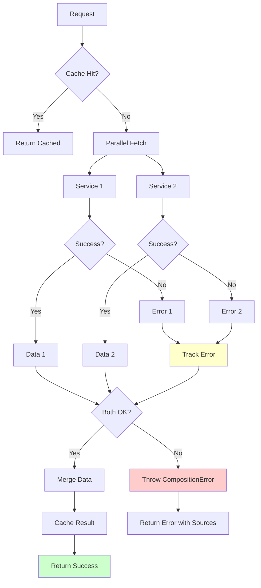
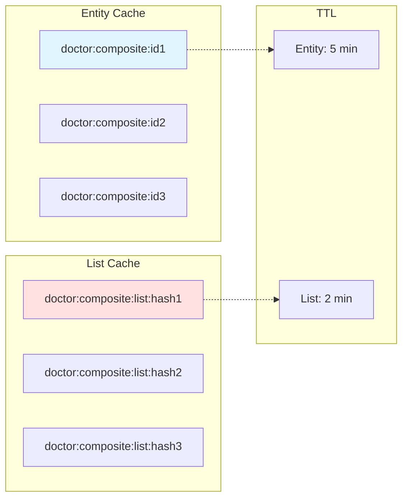
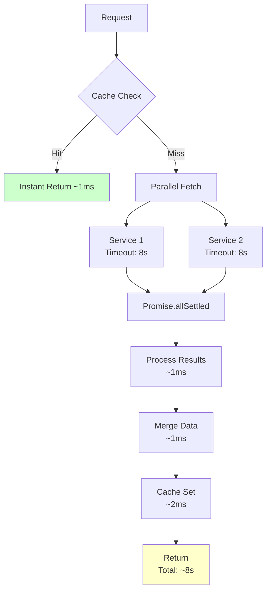

# Read Composition Architecture

## Module Structure

```
read-composition/
├── base/
│   ├── base-composite.service.ts    # Abstract base class
│   └── index.ts
├── helpers/
│   ├── composition.helper.ts        # Utility functions
│   └── index.ts
├── doctor-composite/
│   ├── doctor-composite.service.ts  # Concrete implementation
│   ├── doctor-composite.controller.ts
│   ├── doctor-composite.module.ts
│   └── dto/
├── index.ts                          # Public exports
└── README.md                         # Documentation
```

## Class Diagram



## Sequence Diagram - Get Single Entity



## Sequence Diagram - Search/List



## Data Flow



## Component Dependencies



## Error Handling Flow



## Cache Strategy



## Performance Optimization



---

## Key Benefits Visualized

| Aspect | Before | After | 
|--------|--------|-------|
| **Code Reuse** | ❌ Each service duplicates logic | ✅ Base class shared by all |
| **Cache Strategy** | 🟡 Implemented per service | ✅ Consistent across all |
| **Error Handling** | 🟡 Different per service | ✅ Standardized |
| **Testing** | 🟡 Test each service fully | ✅ Test base once + merge logic |
| **New Services** | ❌ Copy-paste 300+ lines | ✅ Extend + implement merge (~50 lines) |
| **Maintenance** | 🟡 Update multiple places | ✅ Update once in base class |

---

## Extensibility Example

```typescript
// Adding a new PatientCompositeService is just:

@Injectable()
export class PatientCompositeService extends BaseCompositeService<PatientData, PatientQuery> {
  // 1. Set required properties
  protected readonly logger = new Logger(PatientCompositeService.name);
  protected readonly cachePrefix = 'patient:composite:';
  protected readonly listCachePrefix = 'patient:composite:list:';
  protected readonly defaultCacheTtl = 300;
  
  // 2. Inject dependencies
  constructor(
    @Inject('BOOKING_SERVICE') private bookingClient: ClientProxy,
    protected cacheService: CacheService,
    protected clientHelper: MicroserviceClientHelper,
  ) { super(); }
  
  // 3. Use base methods + implement merge
  async getPatient(id: string) {
    return this.getCompositeWithCache(id, config, this.merge);
  }
  
  private merge(booking, account): PatientData {
    return { ...booking, ...account };
  }
}

// That's it! ~30 lines instead of 300+
```
